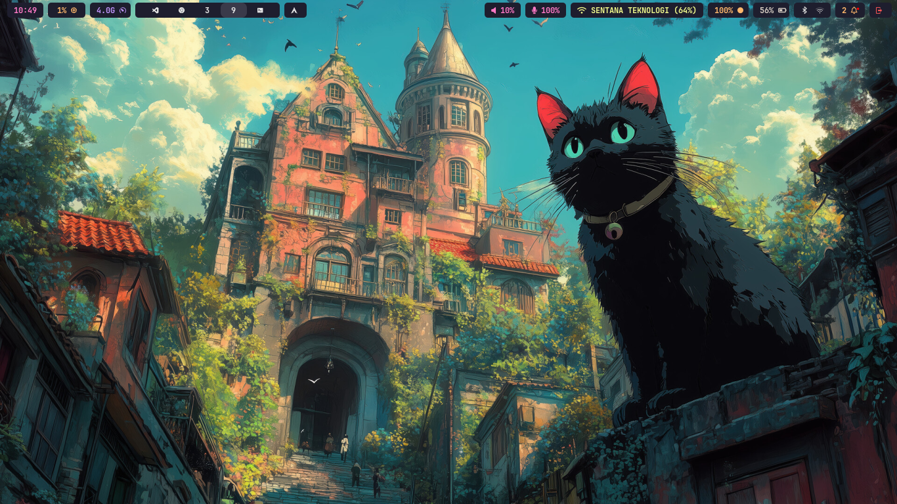
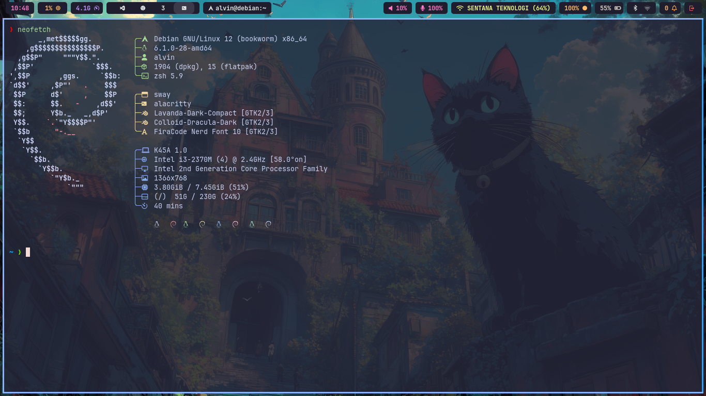
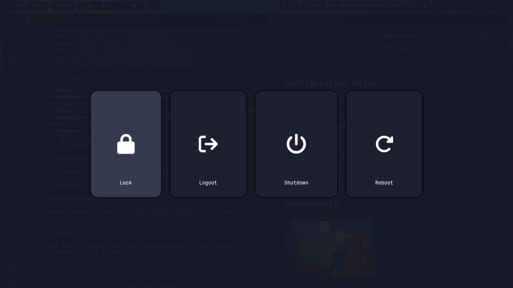

# Sway Dotfiles

This repository contains configuration files (dotfiles) for the Sway window manager on Debian 12. These dotfiles aim to provide a clean, functional, and visually appealing environment for users of the Sway window manager.

## Table of Contents

1. [Overview](#overview)
2. [Features](#features)
3. [Requirements](#requirements)
4. [Configuration Details](#configuration-details)
5. [Screenshots](#screenshots)
6. [Acknowledgments](#acknowledgments)

## Overview

Sway is a tiling Wayland compositor and a drop-in replacement for the i3 window manager. This repository includes customizations and configurations for various tools to enhance the user experience.

## Features
- **Sway**: Lightweight and highly configurable tiling window manager.
- **SwayNC**: Notification center for Wayland.
- **Wofi**: Application launcher.
- **Waybar**: Customizable status bar.
- **Wlogout**: Logout menu with various options.
- **GTK and QT Themeing**:
  - **nwg-look**: GTK theme customization.
  - **qt5ct**: QT application theme customization.
- **SwayIdle**: Idle management daemon for Wayland.
- **Swaylock**: Screen locker with customization support.
- **Swaylock-effects**: Enhanced effects for `swaylock`, including blur, pixelation, and more.
- **swaybg**: Wallpaper utility for Sway.

## Requirements

Ensure you have the following tools installed:

- [Sway](https://swaywm.org/)
- [SwayNC](https://github.com/ErikReider/SwayNotificationCenter)
- [Wofi](https://hg.sr.ht/~scoopta/wofi)
- [Waybar](https://github.com/Alexays/Waybar)
- [Wlogout](https://github.com/ArtsyMacaw/wlogout)
- [nwg-look](https://github.com/nwg-piotr/nwg-look)
- [qt5ct](https://wiki.archlinux.org/title/Qt5ct)
- [SwayIdle](https://github.com/swaywm/swayidle)
- [Swaylock](https://github.com/swaywm/swaylock)
- [Swaylock-effects](https://github.com/mortie/swaylock-effects)
- [swaybg](https://github.com/swaywm/swaybg)

## Configuration Details

- **Sway**: Customized keybindings, workspaces, and window rules.
- **Waybar**: Modules for system information (battery, network, CPU, etc.) and workspace display.
- **Wofi**: A clean, minimal configuration for application launching.
- **Wlogout**: Styled logout menu with options for shutdown, restart, and lock.
- **Swaylock**: Configured to provide a secure and visually appealing screen locker.
- **Swaylock-effects**: Applied effects such as blur and pixelation for an enhanced lock screen experience.
- **swaybg**: Configured to set a custom wallpaper for the Sway desktop.
- **sway-notification-center**: Configured to display notifications in a centralized manner.
- **Themes**:
  - GTK: Configured using `nwg-look`.
  - QT: Styled using `qt5ct`.

## Screenshots

## Acknowledgments

Special thanks to [varrxy](https://github.com/varrxy) for the inspiration and configuration tips.

## License

Feel free to use and adapt this configuration for your needs. Contributions are welcome!

---

Happy tiling!
